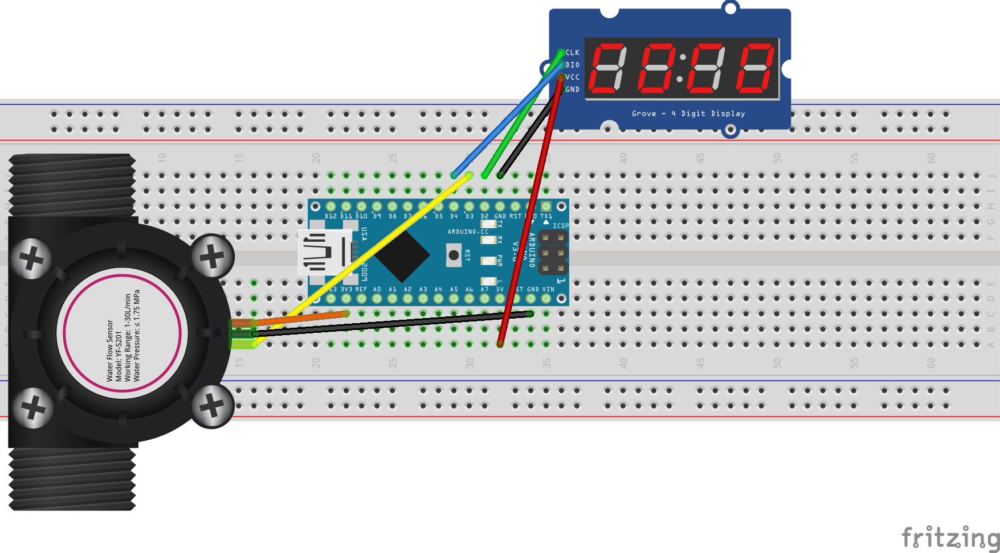

# Flow Meter

This is a reboot on an old flow meter I put together about 5 years ago. I designed this for home brewing. I need to set the exact amount of water to dispense for my boil. 

**Basic meter diagram**

## Connections

### Grove Display

- **GND** Ground on Nano
- **VCC** 5V on Nano
- **CLK** to D2 on Nano (Digital 2)
- **DIO** to D4 on Nano (Digital 4)

### Water Flow Sensor

- **Black** Wire GND to ground on Nano
- **Red** Wire VCC to 3V on Nano
- **Yellow** Wire to D3 on Nano

## Parts List

- Grove 4 digit display (TM1637)
- Arduino (Nano in this case)
- Water Flow Meter (YF-S201)

## Notes

I had trouble with moving the **DIO** and **Yellow** connections around on the digital pins.  This was the best I could get working with both the flow sensor and the LED Display working at the same time.

